# Remote collaboration with Git and GitHub

## Git

Git is the world's foremost Version Control System (VCS). This is a tool that tracks different versions of a code base as a project undergoes development. It keeps track of everyone's work, who is doing what, and what is or isn't included in the main project. It is at the same time a repository of file states, a project history, a tool for teamwork on complex products, and a backup system enabling recovery of past states if something goes wrong.

Git was invented by Linus Torvalds, the inventor of Linux, because he couldn't find a tool to enable development of Linux. Linux is an open-source project with thousands of people contributing from all around the world. Finding nothing suitable to enable that sort of work, Torvalds made his own tool. Some of the characteristics of Git are:

1. Facilitates distributed development: Allows for multiple developers in different locations to work in parallel without requiring constant network connections.
2. Scales to handle large numbers of developers: Linux has thousands of developers making millions of contributions.
3. Quick and efficient.
4. Enforces accountability. Keeps track of who changed files and why.
5. Maintains integrity and trust. Tracks files by their SHA1 hash, so any changes to files are immediately detected.
6. Supports and encourages branched development. Branches allow different developers and teams to work on their own features and eventually merge the features back into the project.
7. Free. You might eventually pay for hosting Git repos used by large teams, or for useful web-based graphical interfaces to manage Git repos, but Git itself is completely free.

## Your Git repo and the Git index

Git works with *repositories*. Git users generally refer to a repository as a *repo*. To illustrate Git workflows I will be using a JetBrains IDE, WebStorm. The interface is similar to other JetBrains IDEs or to VSCode. The commands are the same whether or not one uses an IDE or a command line terminal.

When you start a project in JetBrains IDEs and add a new file, the IDE will ask you if you want to add the file to Git. Check "Don't ask again" and click cancel. You should handle Git interactions manually, at least while you are learning.

Open a terminal window.

Enter the command `git status`. By default, JetBrains IDEs usually create a Git repo for you automatically whenever you create a new project. If this was the case, you should see an output from `git status`. Otherwise you will see an error message like `fatal: not a git repository (or any of the parent directories): .git`. This message tells you that a Git repository has not been created yet. If that is the case, enter `git init` to start your repository. Then, enter `git status`.

After the git repo is initialized and I have added some files, my `git status` command will show me the *index*. 

Working with Git is a three part process. You work on your files in your working directory. Then you *stage* your changes in the index. Finally, you *commit* your changes to the repository. The index keeps track of what you want to commit. 

There are three kinds of files in Git: tracked, ignored, and untracked. This is reflected in the output of `git status`:

In green you can see there is a new file called `.idea/.gitignore`. This file is ready to commit. It is being tracked.

In red we have "Untracked files". These include several files in the `.idea` folder as well as our `index.html` file.

The `.idea` folder is where JetBrains IDEs keep their user preferences and project settings. These settings are not part of the application development process. They are usually specific to the user. If you commit them to the repository, when you share your work with other developers, they will get your preferences and settings and these may override theirs. For this reason, we do not commit the `.idea` folder to the repo. Instead, we want to *ignore* it.

It looks like our IDE automatically staged a file for us when the repo was initialized. This not desirable. The repo should only contain what we want it to contain. This is an example of why it is always important to examine the state of the Git index before committing, so you are sure that you are committing everything you want and only what you want.

Let's fix these problems before proceeding. First, we need to ignore the `.idea` folder and all its contents. To do this, we need to create a special file called `.gitignore`. We create this in our project's *root* directory.

Notice we have put `.idea` in the gitignore file. This tells Git to ignore the directory and all its contents. But wait ... the IDE already staged a file inside the directory. And that file is also called `.gitignore`. What is going on here?

This is one of the more confusing aspects of working with JetBrains IDEs. There is a `.idea` folder, and inside it there is a `.idea/.gitignore` file. But this gitignore belongs to the IDE and its settings. Since it is inside the `.idea` folder, it *only* affects the contents of that folder. It is *not* the same as your project gitignore. 

In fact, you should also personally ignore the contents of the `.idea` folder and treat it as a black box. Don't confuse that gitignore with your project gitignore.

Since the IDE already staged its own `.idea/.gitignore` file, and we don't want that, we are going to *unstage* it. To unstage a file prior to committing, run `git rm --cached <name-of-file>`. In this case, we run `git rm --cached .idea/.gitignore`. Do this for any file you have accidentally staged, or that you staged but then you realized you do don't want to commit it.

Notice here we remove the `.idea/.gitignore` file from the index. Then we run `git status` again. Now, the index reflects our own work and only our own work. There are no files showing in green with the message "Ready to commit". This means our index is empty. There are two files that are untracked. Git sees that these files have been modified in our working directory but have not been staged. 

Our next step is to stage the files. We can do this by naming the files individually as arguments to a `git add` command: `git add .gitignore index.html`. It is more typical to add all the unstaged files at once with the `git add -A` command. But sometimes you don't want to stage everything, so it is important to also be able to add them individually as needed. 

Here we can see that after staging our files, our .gitignore and index.html files are ready to be committed.

Best practice when working with Git is to stage files after you've modified them enough that you may want to save them. That doesn't mean committing immediately. You may want to work on several files before committing. You may commit right after staging, or you may work on a file, stage it, work on another file, stage it, realize you want to work on the first file again, stage the changes, and then commit. 

Staging a file copies it to the Git object store, so when time comes to commit, Git doesn't have to do the work of creating copies of your file contents. It's one of the many ways Git ensures that it is quick and efficient.

Remember: always check the state of your index before staging and committing. Run `git status` before running `git add`. 

## Commits

A commit is a snapshot of the index at a given moment. It records the changes made to a repository since the previous commit. A commit is the only way to introduce changes to the repository, and each commit carries a record of who made it, thus enforcing accountability and ensuring that the history of the project is recoverable through the logs.

To commit your changes to the repo, use the `git commit -m` command. The -m option stands for "message". Each commit must carry a commit message describing what the changes are. Optionally, more information can be added if you enter the interactive text editor.

You now have a commit. You can see the commit history with the `git log` command. 

The Git log command shows the commit history ordered from the latest commit backward. In Git, each commit knows its parent commit and that's it. This particular commit is special because it's the *root* commit so it has no parent.

The output of the `git log` command shows the *SHA1 hash* of the commit object. This is a unique identifier. Git takes SHA1 hashes of everything in its repo object stores. You generally reference a commit by its hash. You can usually use just the first few characters of the hash. After the hash, it shows the commit author, the commit date, and the first line of the commit message, which in this case is the complete commit message.

Let's keep developing now. Let's say I add some more content to my web page.

After making some changes to the web page, I am satisified with my work and I want to commit it to the repo again. How much work to do before committing is a matter of personal preference and team policy. The general rule of thumb is to commit when you've got a significant change ready, or when you've done enough work that you would not like to lose. Or, if you realize the project is in a stable condition and you are about to make some potentially hazardous or experimental changes. When you make a commit, it's like a save point and you can always recover that state at any time.

As always, check your index first by running `git status`. This shows me that the only untracked changes are my changes to `index.html`. I will stage these. Notice that I use the `git add -A` command. This means "add all untracked changes to the index". Then I make my second commit.

Now when I run `git log` again, I can see both commits. 

From now on my workflow will involve checking the index, staging changes, and committing my work to the repo.

# GitHub

If we want to work collaboratively in a team, we need to share our repo. The simplest and most common way to do that is through GitHub. GitHub was started originally to facilitate collaboration on open source projects, but it was so useful that private companies started using it for their own collaborative development projects.

## GitHub credentials

To log in to GitHub you just need an account with a password, although 2FA is always good to have. However, to do a *push* (a repo upload or update), GitHub prefers the SSH protocol, so you need to have an SSH key and share the public key with GitHub.

### SSH keys on a Mac

On a Mac, open a Terminal window. You can click on the magnifying glass on the top right of the menu bar to open the Mac Spotlight feature. Type Terminal to get to a Terminal icon and double click it or hit the return key to open it.

Your Terminal instance will look different because I have customized my terminal's appearance and I use bash instead of the default zshell program.

Enter the command `cd ~/.ssh` to navigate to your SSH directory. Then enter `ls -a` to see if you have any key pairs. You would see something like `id_rsa` and `id_rsa.pub` or `id_ed25519` and `id_ed25519.pub`. If you do not see any key pairs you will need to generate one by entering `ssh-keygen -t ed25519 -C "your_email@example.com"`.

GitHub prefers EdDSA keys (with the ed25519 signature) but RSA will also work. 

Copy your *public* key signature to your clipboard. Use this command: `pbcopy < ~/.ssh/id_ed25519.pub`. 

### SSH keys on a Windows

On a Windows system, open a PowerShell. Select "Run as Administrator". 

Navigate to your home directory with the commmand `cd ~`. Now check if you have an SSH directory using the `Get-ChildItem -Hidden` command.

If there is no `.ssh` folder, create it by typing `mkdir .ssh`. Now you are ready to create your SSH key. Type `ssh-keygen -o -a 100 -t ed25519 -f $env:USERPROFILE\.ssh\id_ed25519 -C`. When prompted to enter a passphrase, just hit return. You will now have a key pair in a folder called `.ssh` in your home directory.

To open the file in a text editor, type `notepad ~\.ssh\id_ed25519.pub`. Make **sure** you add the `.pub` ending so you are copying the public key, not the private key. Then type Ctl+A to select the contents of the file and Ctl+C to copy the contents to your clipboard.

### Add the SSH key to your GitHub account

Now that you have generated an SSH key, you need to add it to your GitHub account. First navigate to your Account Settings. 

Then, select "SSH and GPG keys".

Click on "New SSH key".

Name your SSH key. SSH keys are specific to devices, so I usually name mine with the name of the device and its purpose. If you use a different computer, this SSH key will not work. Then paste the contents of the SSH public key into the box labeled "Key".

## Creating a GitHub repo

You are now ready to set up your repo on GitHub. Click on the plus sign and select "New repository".

Give the repository a name. Decide whether you want the code to be public (generally for open source projects or for your portfolio projects that you want people to know about), or private. Leave the README off for now, we'll add this later if we decide we need it.

Once you create your repo, you will see some windows with some code. These are instructions for how to connect your local and remote repos. We already have an existing local repository, so we are interested in the lower set, to "push an existing repository from the command line".

## Setting your upstream remote

Now we will go back to our IDE. Copy the **first line** of the instructions. It should start with `git remote add`.

We use the `git remote` command to control various aspects of our remote repo configuration. Under the hood, the `git remote` command alters the configuration file contents. Here we are going to add a reference to a remote repository. 

The network address uses a format specific to Git, called a Git URL. It will look something like `git@github.com:jruedas1/awesome-site.git`. Since this is really long and hard to remember, Git implements aliases. Our command `git remote add origin git@github.com:jruedas1/awesome-site.git` means to add a reference to `git@github.com:jruedas1/awesome-site.git` with the alias `origin`. Origin is the default and traditional alias for the repository that a team pulls from and pushes to.

After adding the remote reference, we want to make sure that our default branch is named `main`. Some versions of Git will name the default branch `master`. GitHub prefers the term `main`. Use the `git branch` command to see the name of the branch. If it is `master`, you should rename it to avoid conflicts with GitHub's default naming. Use the command `git branch -M main` to ensure the default branch is called `main`. 

## Pushing to a GitHub repo

Finally, we are ready to *push* our code to GitHub. The first time we push, we use the command `git push -u origin main`. This means we want to push the `main` branch to the remote referenced by the alias `origin`. The `-u` argument means to set this push branch/remote combination as the default "upstream". From now on, `origin main` will be the default configuration, so we only need to enter `git push`. 

Submit the command, and you should see output showing the transfer of Git's object store to the remote repository. 

Go back to GitHub and refresh the page. You should now see the repository contents. These are the two files you've committed so far, the `.gitignore` and the `index.html`. 

## Cloning a repo

The next step in collaboration is for someone else to get a copy of your repo. This operation is called *cloning*. The clone operation is very simple with JetBrains IDEs and GitHub. We will also see how to clone a repo on the command line, which is very straightforward.

Navigate to the GitHub repo you want to clone. Click on the green "Code" button. 

Ensure that the "SSH" option is selected, **not** HTTPS or GitHub CLI. Although Git does allow for HTTPS operations, GitHub strongly prefers SSH and you may not be able to clone over HTTPS.

Copy the Git URL to your clipboard.

### Cloning with a JetBrains IDE

Open your IDE. Click on "Clone Repository". If it opens to your last project, just close that project to get to this view.

Click on the "Browse" button to select the destination folder for your project.

Once you've found where you want your project, create a new folder to hold the files. You can name it the same as the repo or give it a custom name.

Once you have the folder created, click "Open".

You're ready to clone the repo now. Paste the copied Git URL in the "URL" form field and click "Clone".

You'll be asked if you trust the project or prefer to previews in safe mode. In this case, you are collaborating with a known small team on a web project, so it is safe to trust the project.

You are now the proud owner of a copy of the original repository. Note that this means not only the files, but also the commit history.

### Cloning on the command line

Cloning on the command line is even simpler. The CLI clone operation automatically creates a folder for you with the same name as the repository.

Here, I navigated to the Sites directory, then just typed `git clone` and the Git URL for the repo I wanted to clone. I don't have to create the `awesome-site` directory, the clone operation will create it for me. After the objects have been transferred to my system, I can see that the directory has been created and it contains three things: an `index.html` file, a `.gitignore` file, and the `.git` directory.

Note that this would not work if I already had a directory called `awesome-site` at this location in my file system. 

Now I can open Webstorm and, instead of "New project" or "Clone repository", select "Open". 

Navigate to the location of the newly cloned repo in your file system.

You can open the project and you have access to all the files as well as the commit history.

## Feature branches for team projects

For team collaboration on development projects, it is important not to do original work on the main branch. Instead, to avoid code conflicts and other problems, it is best practice to work in feature branches. This is called the feature branch workflow.

It is helpful to understand how commits are related. In Git, each commit is an object. Git calculates a SHA1 hash for the commit object and you can reference any commit by its hash. In addition, each commit knows its parent commit (except the root commit, which has no parent).

For example, in our current project, we have two commits. I can see the contents of the object referenced by a hash using the `git cat-file -p` command. The `-p` argument means "pretty-print" the contents. If I just want to know what type of object it is, I use the `-t` argument for "type".

Notice here the output of `git cat-file -t 6fb456d` is "commit". This tells us the object referenced by the hash that starts with 6fb45d is a commit object. When we look at the output of the `git cat-file -p` command we see that it references a tree object, a parent commit, an author, and a committer, and also has the commit message. 

The parent commit, referenced by the hash that starts with eb918, is the root commit. The tree object in this case is just a listing of the files in the project. Each file is stored as a blob object. 

This is basically how Git preserves project states: files are stored as blob objects, the working directory structure is preserved as one or more tree objects, and the commit points to one tree. The commit also points to its parent commit.

When we create a branch, we create an alternative commit history parallel to and independent of the main branch commit history. Think of a commit history as a sequence of commits. In our current repo state, there is only one branch. Each commit is a child of the previous commit. There is only one line of commits.

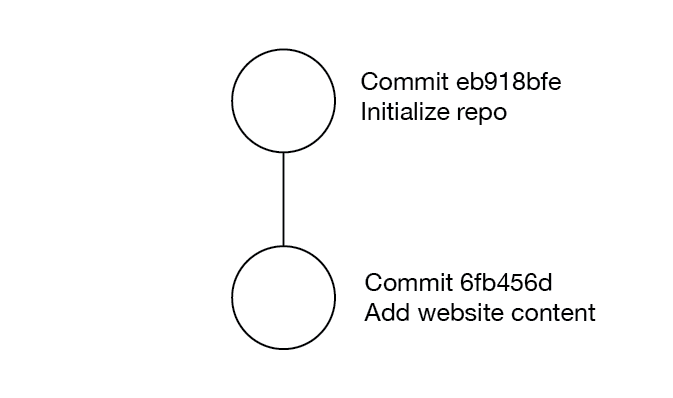

When we create a branch, we create a situation where it is possible for several commits to have the same parent.

To create a commit, use the command `git branch name-of-branch`. Then switch to that branch by typing `git switch name-of-branch`. In practice, you usually want to switch to any branch you create when you create it, so there is a shortcut: `git switch -c name-of-branch`. 

Let's assume the person who cloned my repo is going to work on visual design. They could create a branch called `site-style`. 

The designer creates a file called `style.css`. The IDE immediately asks if the designer wants to add the new file to Git. The designer says no. Keep in mind we answered this earlier, but that was in a different repository, and a different WebStorm project, so that setting is not in this project. 

Now the designer works on the site styles. Once they've reached a certain point in their work, they add the file to the index and commit. 

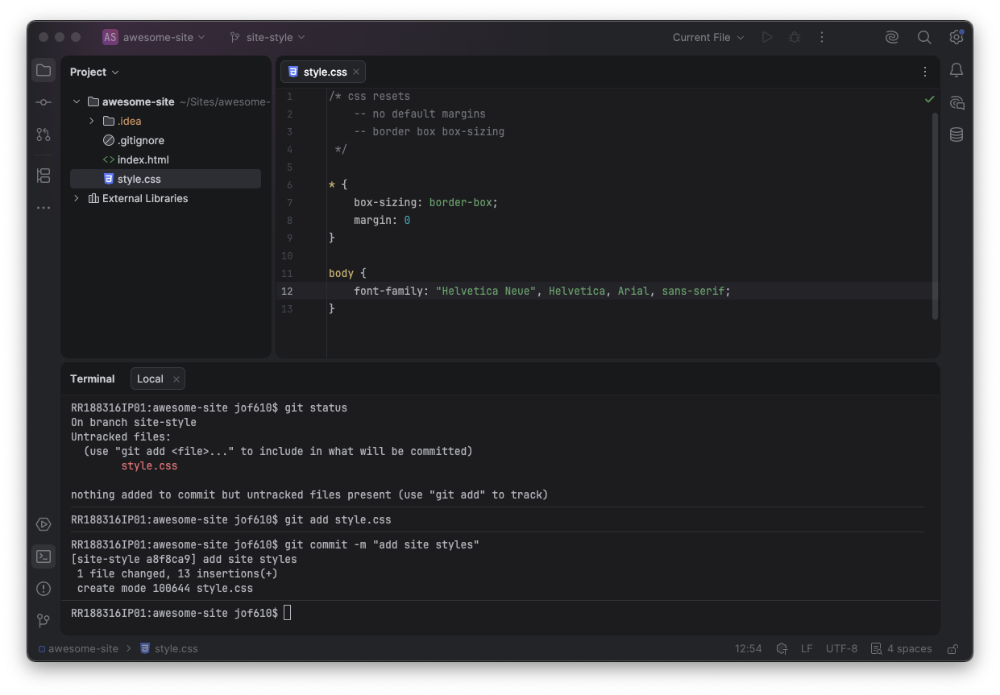

Meanwhile, the project founder continues to work on content. Best practice, now that there is a team and everyone is working on different parts of the application, is for everyone to work on branches and no one to work on main anymore.

So the founder creates a branch called `content` and switches to it. 

The founder, now content author, develops new content and makes a commit.

Now we have two divergent project histories. Here's the project history in the content author's repo:

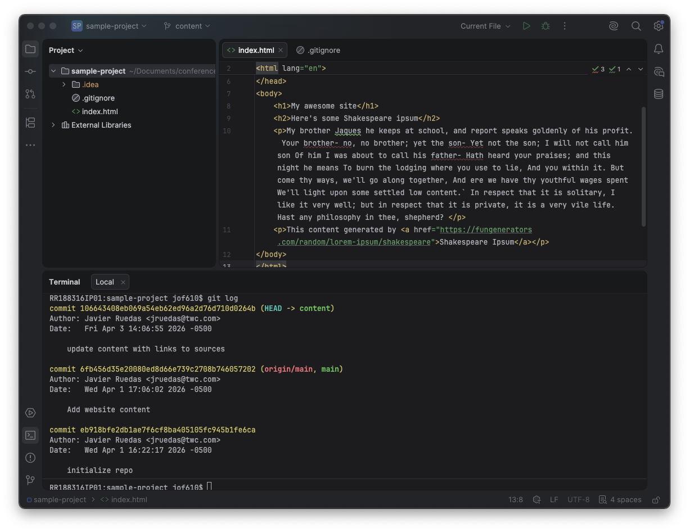

Here is the project history in the designer's repo: 

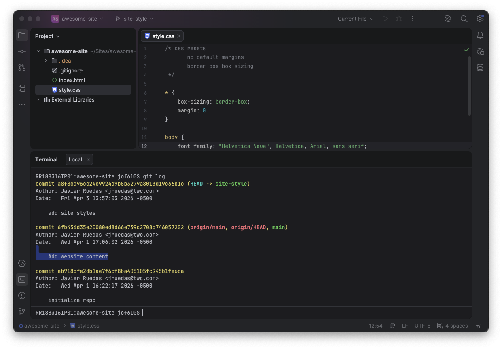

Let's visualize the project history.

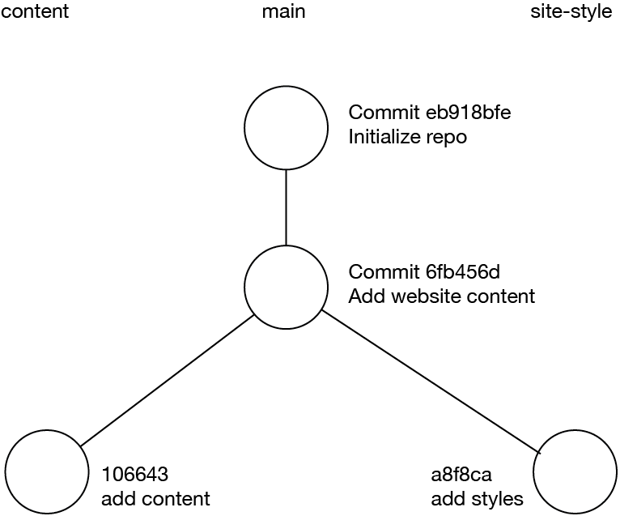

## Merging branches

Now the content author decides it's time to share their code with the designer. They need to merge the contents of the two branches. There are several different approaches possible. For simplicity's sake, we'll demonstrate merging the content of the feature branch to the main branch.

The content author switches back to the main branch. Notice that the content generated in the `content` branch is not there any more. The terminal has a message stating that this main branch is up to date with the `origin/main` branch, which is the main branch on the remote repo. Just to double-check, the content author issues a `git fetch` command. This command updates the local repo about any changes to the remote repo involving branches that also exist locally -- in this case, just the main branch.

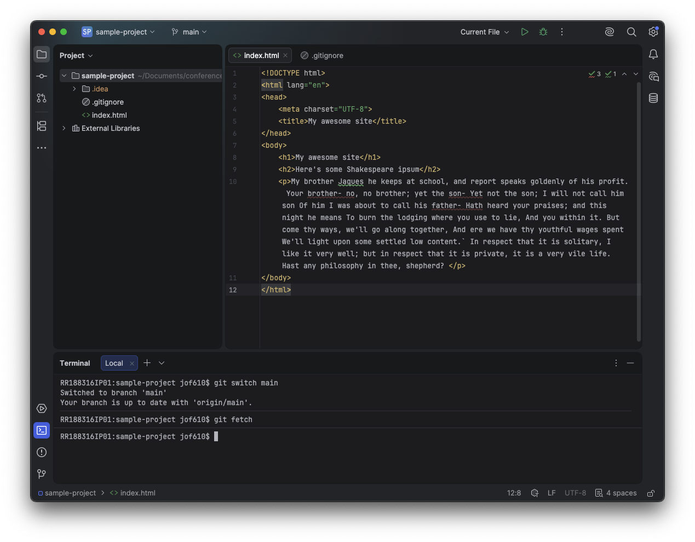

Now, the content author *merges* the contents of the `content` branch into the `main` branch. The command for this is `git merge name-of-branch-to-be-merged`. Git decides what kind of merge it will carry out; if it can't make up its mind it will ask. In this case, it carries out what's called a 'Fast-forward' merge. From Git's perspective, this is easy. Everything that is in the current branch (main) is already present in the other branch (content). Both commits in the main branch are already in the content branch. All Git has to do is 'fast forward' the main branch to the same state as the content branch. 

Notice, when I run `git status` now, the output tells me I am on the main branch, and my content is 1 commit ahead of the remote main branch. A `git log` command shows me that the commit history on the main branch has been updated and I now have 3 commits on that branch. 

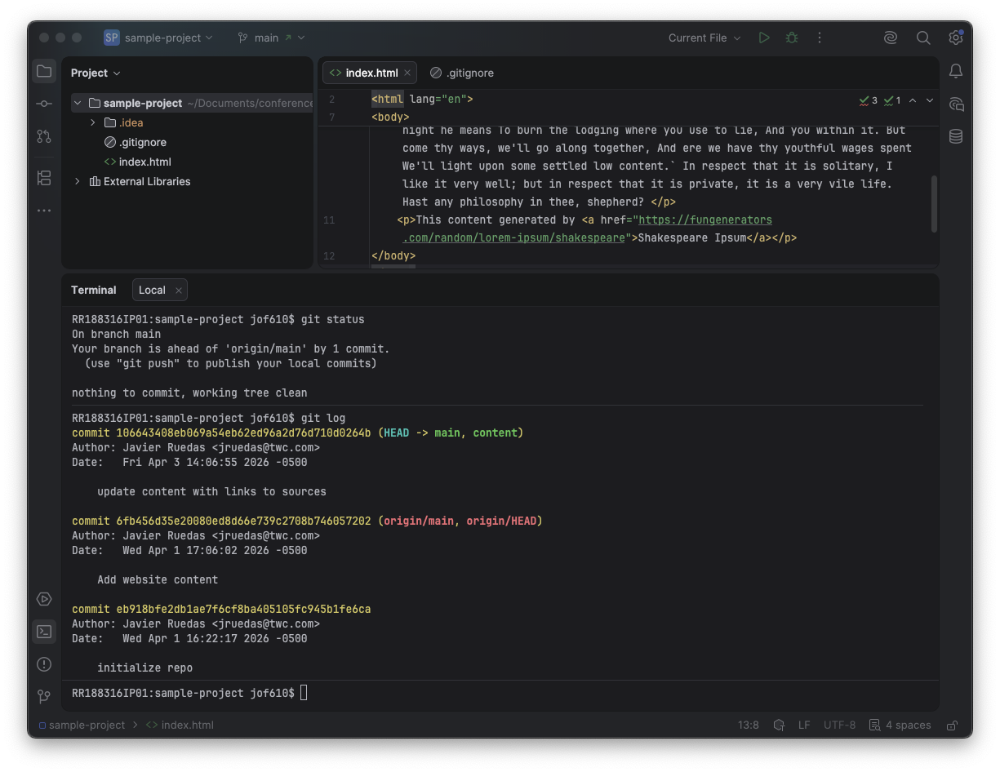

Now I can *publish* the changes by pushing them to the remote repo. 

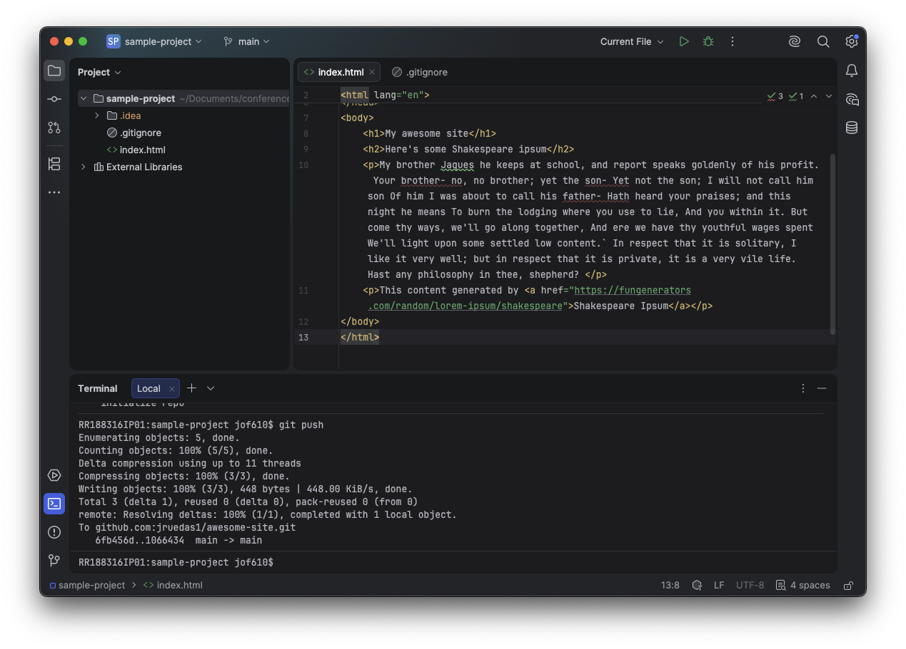

If I go to GitHub and inspect the contents of the `index.html` page there, I will see that the content has been updated.

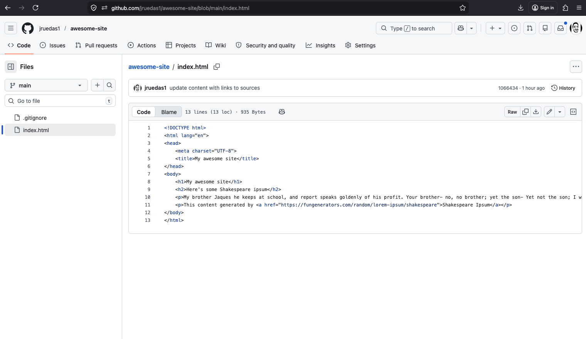

Here's a visualization of the project history so far.

Now let's go back to the designer's copy of the repo. Let's say the designer has also decided to publish their changes. The proper procedure will be shown below, but for now let's illustrate a workflow in which every team member merges their content to main locally and then pushes their version of the main branch. This will help us to understand the process of creating feature branches and merging them back into the main branch.

Before merging to main, the designer needs to make sure that their main branch is up to date with the remote main. So they run the `git fetch` command. The `git fetch` command will update their *remote tracking branches*. A remote tracking branch is a branch on a local repo that is set to track a remote branch. This branch, called `origin/main`, was created automatically during the clone operation that created this repo. 

If the local main was up to date with the remote main, there would be no output to the `git fetch` command. Intstead, I can see that it downloads some objects and puts them on the `origin/main` branch. This tells me that my local main is not up to date with the remote main. So the designer switches to the main branch and prepares to update their local main.

Notice that in the main branch, the `styles.css` file does not exist, and the content of the `index.html` branch is not up to date with the latest content pushed by the content author.

A `git pull` command can pull the contents of the remote into the local repo. 

Note that `git pull` is really a two-step operation under the hood. It runs `git fetch` -- which as we have seen here, updates `origin/master`, and then it runs `git merge origin/master`. We could also just run `git merge origin/master` right now, because we *already* ran `git fetch` and so our `origin/master` is up to date with the remote master. But it is more usual to use `git pull`. Many people don't bother with `git fetch` at all, but it is helpful to know the command and understand that you can fetch remote content to your 'local' remote tracking branch without merging it.

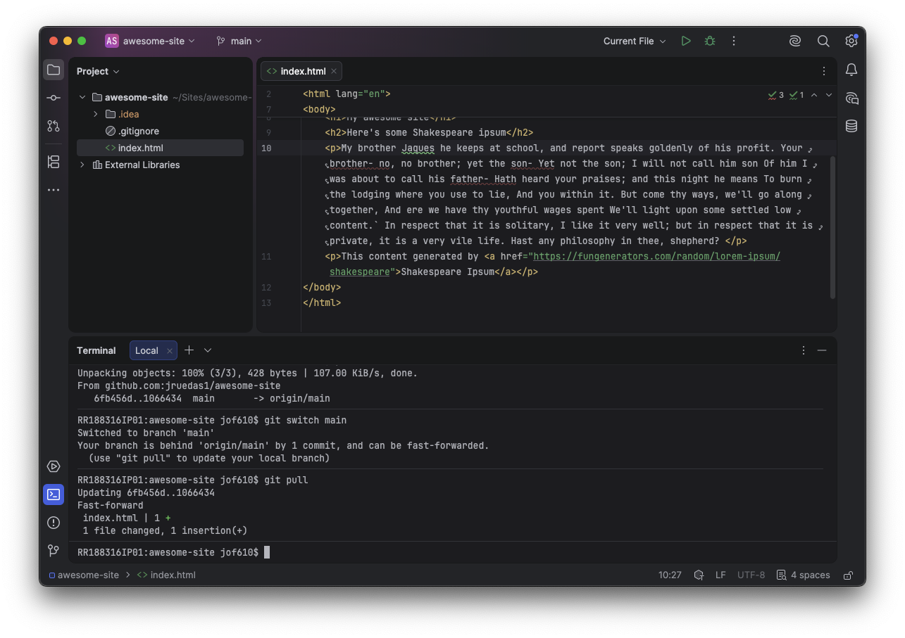

Now the designer's local main branch is up to date with the remote branch and synchronized with the content author's repo. It is time to merge the new styles into the main branch.

The designer enters `git branch` to list the names of the branches, then `git merge site-style` to merge the style content into the main branch. The terminal enters a text editor to enter a commit message.

By default, this text editor is vim. This can be changed in the git configuration file. 

Why are we having to enter this message here, when we did not have to in merging the the content to main branches in the content author's repo? It's because we can't do a fast-forward merge here. There is a commit in main now that is not in the site-style branch. Because of that, Git has to merge the histories as well as the content. When this happens, Git treats the merge as a commit and requires a commit message. 

Press the `i` key to enter Insert mode. Then add any further information you might want to communicate to the team about the reasoning behind the merge. 

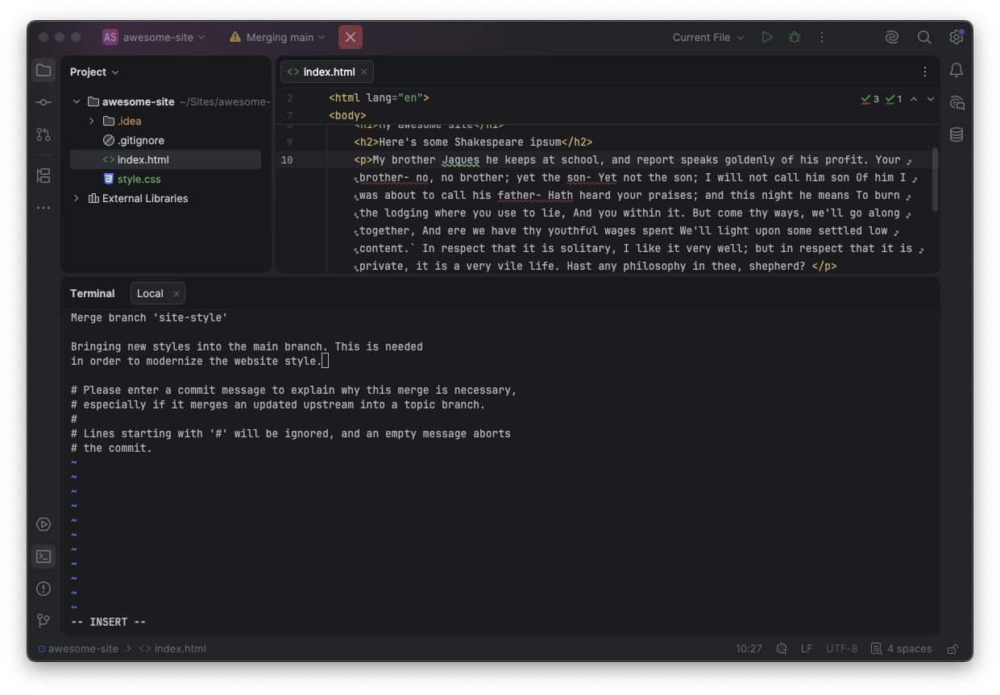

Once you've entered your commit message, press `esc` to exit insert mode and enter command mode. Then enter `:wq` to write the changes to disk and quit the text editor. Hit enter.

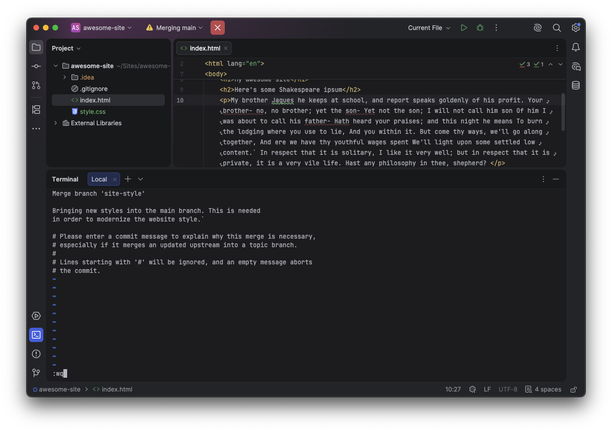

We can now see the output of our `git merge` command.

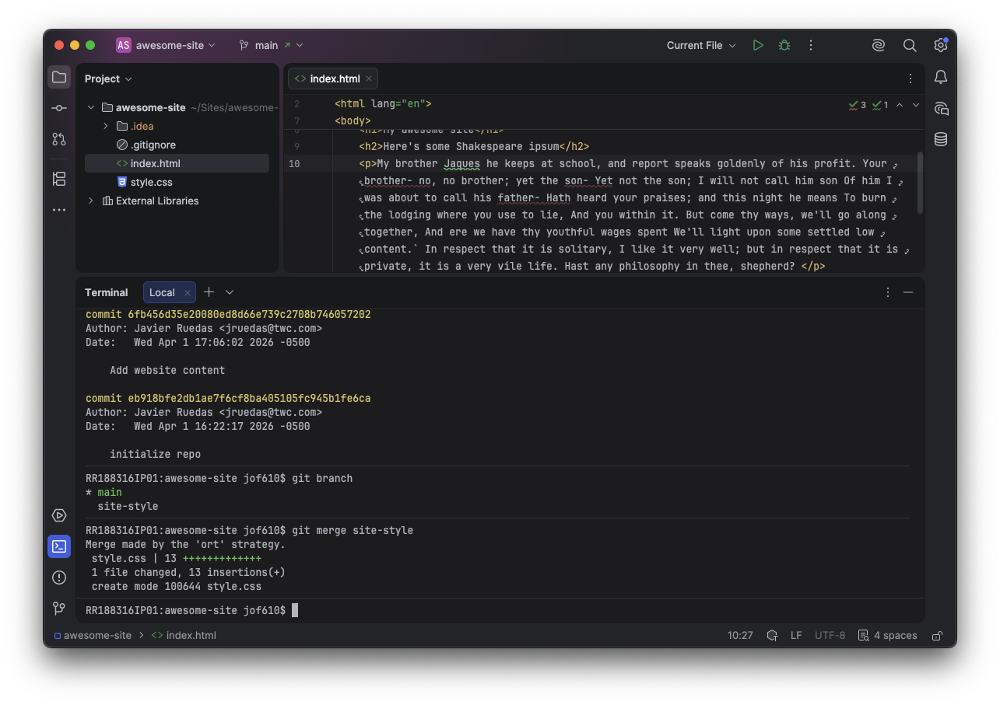

Notice Git did not use the fast-forward merge, it used its more complex optimized recursive tree strategy ('ort'), a very efficient and intelligent way of merging divergent histories.

Notice the latest commit in this repo ("add site styles") did not get tacked onto the end of the history, it got placed before the last content commit. Git decides what is the most reasonable way to order the history; in this case it could have gone either way. Sometimes you will see commits out of chronological order. 

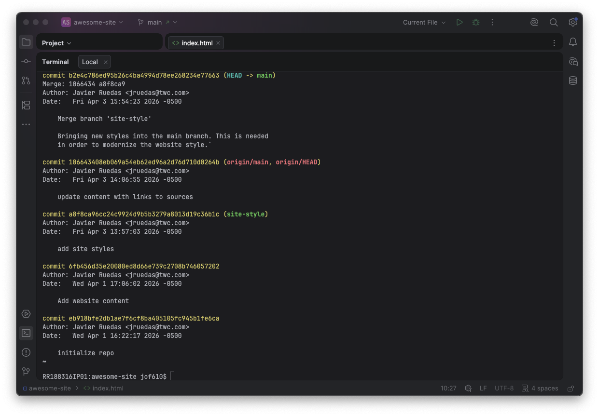

Now the designer can share their work by pushing to the remote repo: `git push`. The remote now has the style sheet. 

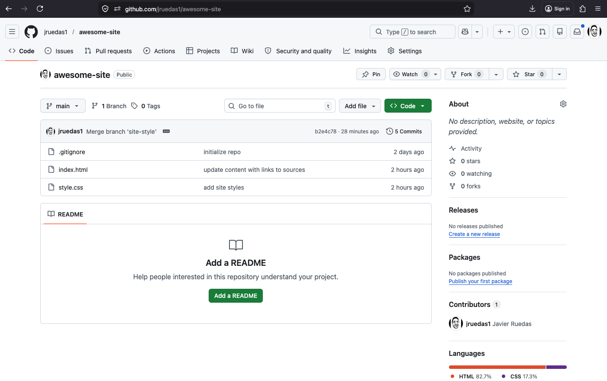

The content author can now pull the new contents of the main branch. Normally I would `git fetch` to see if there have been any changes. Here, though, I show that you can also just issue `git pull`. This will combine `git fetch` and `git merge origin/main` in one command.

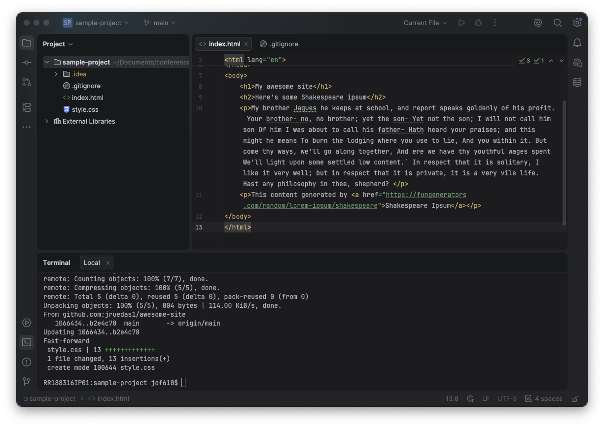

All the repositories are now synchronized.

## Handling merge conflicts

## Pushing a branch to GitHub

## The pull request

## Pulling the updated code